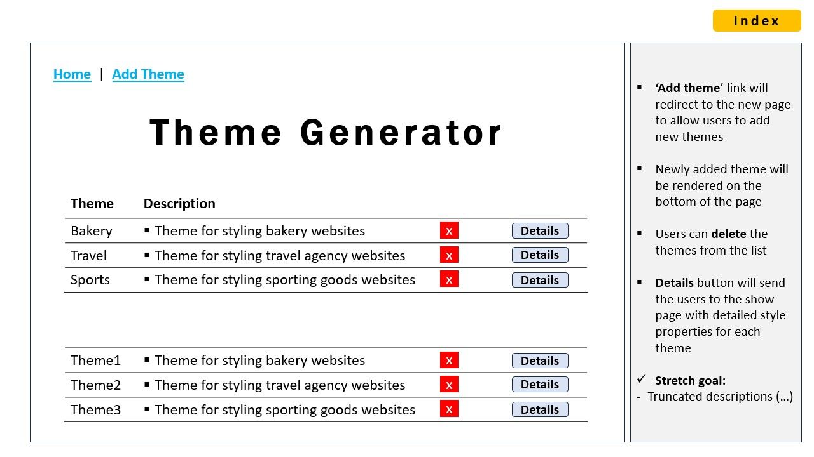
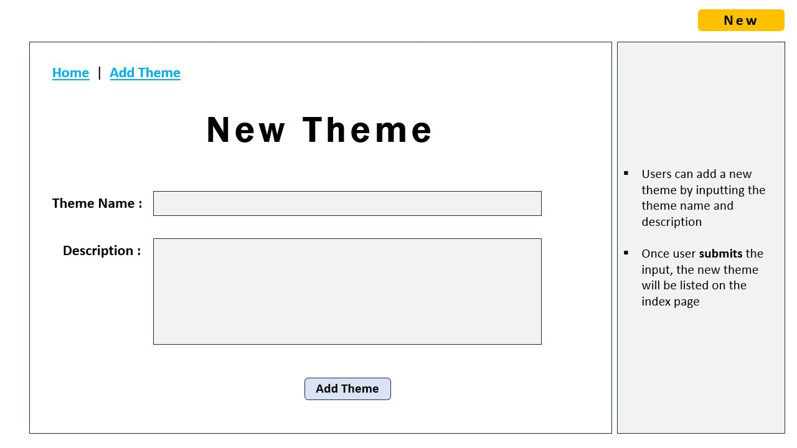
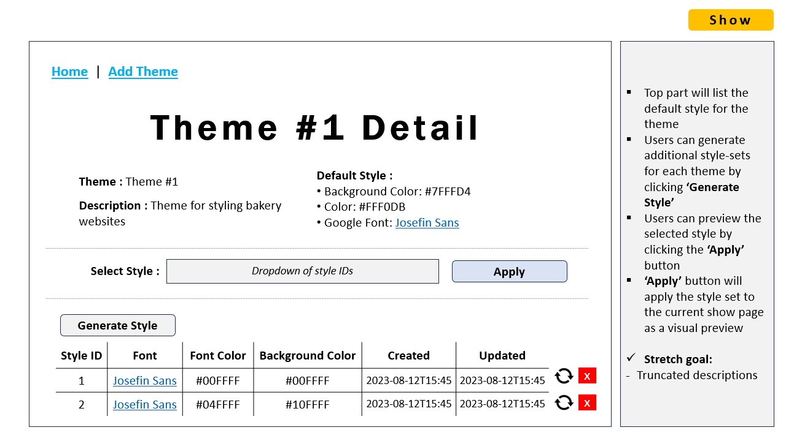

# Theme Generator - Project 2 Planning

Team: ALELLA Ltd.

Team members:
- Alex Stepanov
- Ellen Park
- Lauren Mendoza

Roles: 
- Frontend: Ellen 
- Backend: Lauren 
- Git Wrangler: Lauren 
- Design Lead: Ellen 
- Research / Documentation Lead: Alex

## Project Choice - Theme Generator

Theme Generator project provides users with a streamlined and accessible way to generate and visualize theme styles for their client applications based on theme name and its description only!

## Sprint board

Trello sprint board [link](https://trello.com/b/1AhAgCnS/theme-generator)

## Wireframes

### Home Page

### Add Theme Page

### Theme Details Page

## Models/Schemas

### Primary Schema: Theme

| Property | Type | Validations | Default Value |
|----------|----------|----------|----------|
| _id | Objectid | n/a | n/a |
| theme | String | Required. Allow no more than 40 characters| n/a |
| description | String | Required. Allow no more than 300 characters | n/a |
| defaultStyle | String | n/a | defaultTheme |
| currentStyle | ObjectId, ref: "Styleset" | n/a | n/a |
| user | ObjectId, ref: "User" | Required | n/a |

### Seconadary Schema: Styleset

| Property | Type | Validations | Default Value |
|----------|----------|----------|----------|
| _id | Objectid | n/a | n/a |
| theme | Objectid, ref: 'Theme' | n/a | n/a |
| fontColor | String | n/a | n/a |
| googleFontHref | String | n/a | n/a |
| googleFontFamily | String | n/a | n/a |
| mainBackgroundColor | String | n/a | n/a |
| menuBackgroundColor | String | n/a | n/a |
| tableHeaderColor | String | n/a | n/a |
| buttonColor | String | n/a | n/a |
| buttonHoverColor | String | n/a | n/a |
| user | Objectid, ref: "User" | Required | n/a |

### Seconadary Schema: User

| Property | Type | Validations | Default Value |
|----------|----------|----------|----------|
| _id | Objectid | n/a | n/a |
| name | String | n/a | n/a |
| googleId | String | Required | n/a |
| email | String | n/a | n/a |
| avatar | String | n/a | n/a |

## Entity Relationship Diagram

__Note:__ Each Theme have zero or many Stylesets. Each Styleset belongs to one and only one Theme.

## MVP CRUD / RESTful Routes
 Route name | CRUD operation | URL endpoint | Module name | Controller Action | Notes |
|----------|----------|----------|----------|----------|----------|
 GET | View a form to add a new theme | /themes/new | Theme | newTheme | |
 POST |Create a theme | /themes | Theme | createTheme | Res.redirect to /themes/${createdTheme._id} |
 GET | Read all themes | /themes | Theme | index | |
 DELETE | Delete specified theme | /themes/:id | Theme | deleteTheme | Res.redirect to /themes/ |
 GET | Read a specific theme | /themes/:id | Theme | show | |
 POST | Create a styleset for a theme (1:M) | /themes/:id/stylesets | Styleset | createStyleset | Res.redirect to /themes/${stylesetData.theme} |
 PUT | Update a specific styleset | /stylesets/:id | Styleset | updateStyleset | Res.redirect to /themes/${stylesetData.theme} |
 DELETE | Delete a specific styleset | /stylesets/:id | Styleset | deleteStyleset | |

## User Stories

| US_ID# | Short Name | Description | SP | Priority | Risk | Sprint | Dependant on US ID# |
|-------|------------|-------------|----|----------|------|--------|---------------------|
| TG-1 | View list of themes | AAU, I want to view a list of all themes (index functionality) that displays Theme Name, Description. |  | 1 | Low | 1 |  |
| TG-2       | Create themes | AAU, I want to create themes by entering the information on a page (new functionality) that has a form and submitting it |  | 1 | Low | 1 |  |
| TG-3       | Navigation bar menu | AAU, I want to be able to access each view via a navigation bar at the top of the page with links to HOME and ADD THEMES |  | 1 | Low | 1 | TG-1, TG-2 |
| TG-4       | View theme details | AAU, when viewing the list of themes, I want to click on a "DETAIL" link or button displayed next to each theme to view all of the properties for that theme (show view) |  | 1 | Low | 1 | TG-1 |
| TG-5       | Generate style | AAU, when viewing the details page (show view) for a theme, I want to be able to generate a style by clicking on “Generate” button |  | 1 | High | 1 | TG-4 |
| TG-6       | View list of styles | AAU, when viewing the details page (show view) for a theme, I want to see a list of that theme's styles (properties as per Styleset model) |  | 1 | Low | 1 | TG-4, TG-5 |
| TG-7       | Sort themes by theme name | AAU, I want to view a list of all themes sorted by the theme name in ascending order. |  | 2 | Low | 2 | TG-1 |
| TG-8       | Delete a theme | AAU, when viewing the list of themes, I want to delete a theme by clicking on delete icon next to this theme |  | 1 | Low | 1 | TG-1 |
| TG-9       | Select default style | AAU, when viewing the details page (show view) for a theme, I want to select a default style for a theme to preview the style by applying its properties to the page |  | 1 | Moderate | 1 | TG-5 |
| TG-10      | Display chosen default style details | AAU, when viewing the details page (show view) for a theme, I want to see the chosen default style details of this theme. |  | 1 | Low | 1 | TG-9 |
| TG-11      | Update style | AAU, when viewing the details page (show view) for a theme, I want to update a style by clicking on update icon next to each row of the style list. |  | 1 | Moderate | 1 | TG-6 |
| TG-12      | Delete style | AAU, when viewing the details page (show view) for a theme, I want to delete a style by clicking on delete icon next to each row of the style list. |  | 1 | Low | 1 | TG-6 |
| TG-13      | Preview styles in rows of style list | AAU, when viewing the details page (show view) for a theme, I want to preview styles by applying corresponding styles to each row in the list of styles. |  | 2 | Moderate | 2 | TG-6 |
| TG-14      | Apply default theme style to application | AAU, I want to apply a default theme style to the whole web application (wireframe is required) |  | 3 | High | 3 | TG-9 |
| TG-15      | Truncate theme description | AAU, when viewing the list of themes, I want to see theme description text truncated. |  | 2 | Low | 2 | TG-1 |
| TG-16      | Export default theme style in CSS format | AAU, when viewing the list of themes, I want to export a default theme style in CSS format |  | 3 | High | 3 | TG-9 |
| TG-17      | Get customed style properties | AAU, I want to get customed style properties, not only those that were hardcoded initially |  | 3 | High | 3 | Tg-6 |
| TG-18      | Sign up using Google account | AAU, I want to be able to sign up using Google account |  | 2 | Moderate | 1 |  |
| TG-19      | Log in using Google account | AAAH, I want to be able to log in using Google account. |  | 2 | Moderate | 1 | TG-18 |
| TG-20      | Add Theme only if logged in | AAU, I want to access Add Theme link and be able to add a new theme only if I am logged in user |  | 2 | Low | 1 | TG-19 |
| TG-21      | Generate styleset only if logged in | AAU, I want to be able to generate a new styleset only if I am logged in user |  | 2 | Low | 1 | TG-19 |
| TG-22      | Delete theme only if created it | AAU, I want to be able to delete a theme only if I am logged in user and created this theme |  | 2 | Low | 1 | TG-19 |
| TG-23      | Update styleset only if created it | AAU, I want to be able to update a styleset only if I am logged in user and created this styleset |  | 2 | Low | 1 | TG-19 |
| TG-24      | Delete styleset only if created it | AAU, I want to be able to delete a styleset only if I am logged in user and created this styleset |  | 2 | Low | 1 | TG-19 |
